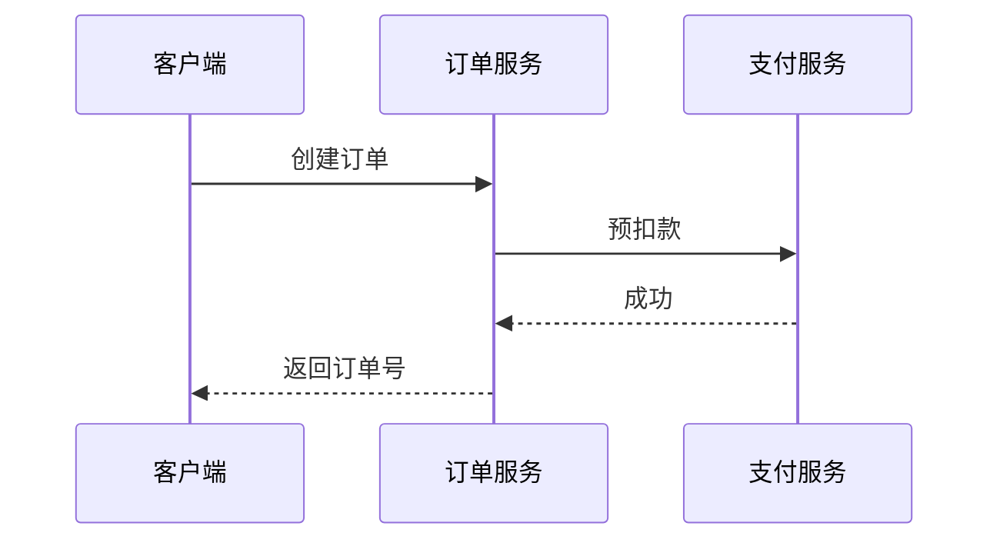

# {任务名称} — 模块详细设计（可选）

> 本文档针对复杂/核心模块的详细设计（时序、领域模型、状态流转、关键规则算法）。
> 仅当某模块复杂度高、涉及多表多接口协同、或有重要算法/状态机时编写；简单 CRUD 模块可跳过。
> 上游：`tech/03`~`tech/05`。

## 模块: [下单流程]
### 1. 场景与目标
- [什么业务目标；涉及哪些表/接口]

### 2. 时序图（核心流程）

### 3. 领域模型与状态机
- 状态: [待支付 → 已支付 → 已发货 → 已完成 / 已取消]
- 流转条件: [...]

### 4. 关键规则与算法
- [库存扣减策略；分布式锁；补偿]
- [金额计算精度（分单位）]

### 5. 异常与回滚
- [超时 / 失败补偿 / 对账]
